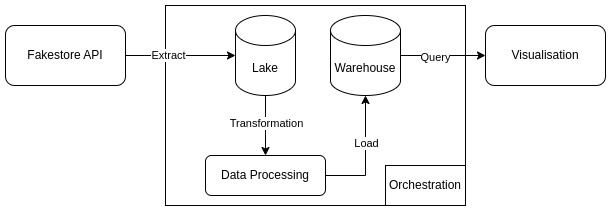

# DAGSTER ETL PIPELINE END-TO-END 🚀

A simple ETL (Extract, Transform, Load) pipeline uses Dagster (https://dagster.io/) to manage the end-to-end data flow.
This pipeline retrieves user data from the FakeStore API (https://fakestoreapi.com/), stores it in a data lake, performs transformations, and then stores the clean results in a clickhouse data warehouse.

---

## ⚙️ Tech Stack
- **Dagster** → workflow orchestration & scheduling
- **Python pandas** → data processing
- **Docker Compose** → environment service (ClickHouse, Metabase, Postgres)
- **Metabase** → data visualization
- **ClickHouse** → analytical database / warehouse

---

## Etl Flow



---

## Project Structure
```bash
.
├── data
│   ├── lake
│   └── warehouse
├── docker-compose.yml
├── LICENCE.md
├── pyproject.toml
├── README.md
├── requirements.txt
├── src
│   └── fakestore
│       ├── definitions.py
│       ├── defs
│       │   ├── cart
│       │   │   └── assets.py
│       │   ├── __init__.py
│       │   ├── jobs.py
│       │   ├── product
│       │   │   └── assets.py
│       │   ├── schedules.py
│       │   └── user
│       │       ├── assets.py
│       │       ├── __init__.py
│       │       └── __pycache__
│       ├── __init__.py
└── tests
    └── __init__.py
```

---

## Installation

### 1. Clone Repository
```bash
git clone https://github.com/nurmanhadi/dagster-fakestore-etl.git
```
### 2. Setup Environtment
create `.env` file
```bash
CLICKHOUSE_HOST=localhost
CLICKHOUSE_PORT=8123
CLICKHOUSE_USER=fakestore
CLICKHOUSE_PASSWORD=fakestore
CLICKHOUSE_DBNAME=fakestore

POSTGRES_USER=fakestore
POSTGRES_DB=fakestore
POSTGRES_PASSWORD=fakestore
```

### 3. Install Dependencies
```bash
# create venv
python3 -m venv .venv
source .venv/bin/activate # linux/mac

# run pip installation
pip install --editable .
pip install -r requirements.txt
```

### 4. Run Docker Compose
```bash
docker compose up -d
```

### 5. Run Project
```bash
dg dev
```

---

## How to Access Services
- Dagster UI → [http://localhost:3000](http://localhost:3000)
- Metabase → [http://localhost:3001](http://localhost:3001)
- ClickHouse (HTTP) → [http://localhost:18123](http://localhost:18123)
- Postgres → localhost:5432

---
